  Hello, if you're reading this, welcome to my portfolio. This portfolio ranges from straightforward to intermediate-skilled coding projects, showcasing an understanding of data analysis and cybersecurity fundamentals. These are only meant to showcase experience and are not fully functional due to personal information required for proper utilization, legal restrictions, and possible TOS infringements when running the script. 

  While I have created other projects, it's not paramount that I list them, as this portfolio showcases a degree of experience and not every creation I have made. 

# Project 1: Wireshark Network Map

  This program uses a Wireshark datum and a GeoLiteCity file to locate the inbound and outbound traffic from an IP source. It converts the data to a KLM file readable for Google Maps, producing a visualized version of web traffic. 

> The first bits of code are the simplest: pip downloads, imports, and quick function naming for further codes. 

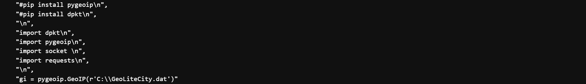

> This code finds the source IP and target/traffic IPs, locates them based on longitude and latitude from the GroLiteCite file, and files them in supported KML format. The code on top is the starting work of an automated IP puller for quick IP changes, but for this project, it seemed repetitious.

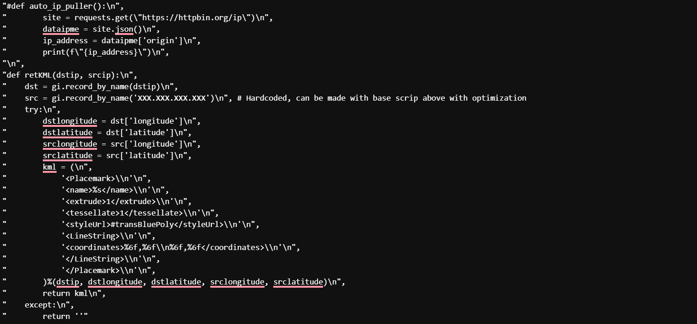

> This portion defines the function of the code above. It allows the code above to find the source IP, traffic IPs, and formulations of the KML file correctly. 

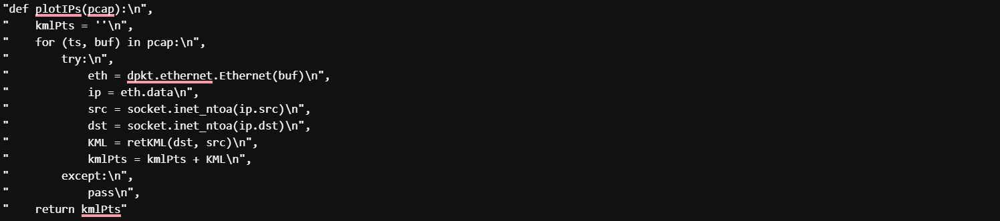

> These are the final requirements for the KML file formation. Here, it receives its header, plot style, etc, and is combined with the other formatted parts of the file from the previous codes. 

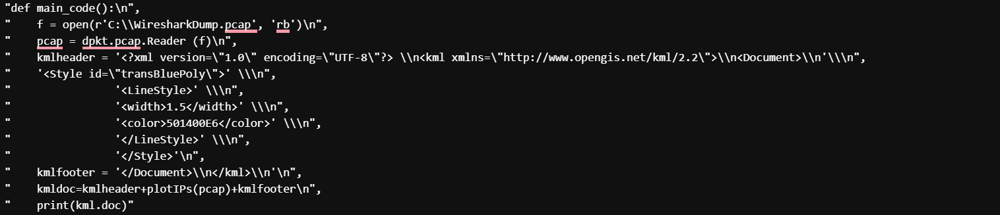
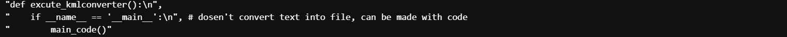

> After taking the data and making a KML file, you can place it directly into a program accepting KML format. This map is what it should look like. This is a basic use of the CSV file. It can be used in many more productive ways, especially in cybersecurity departments.

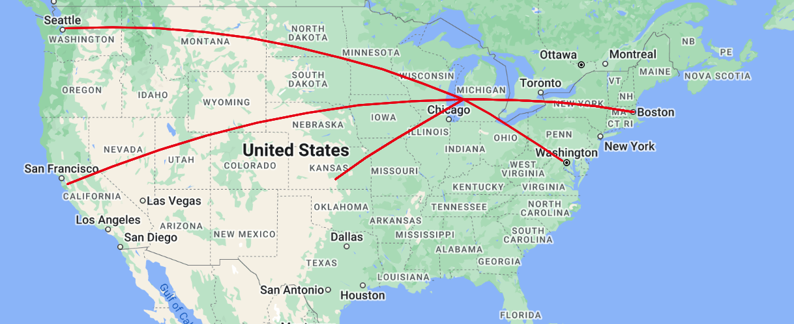

# Projcet 2: Network Engineering

  This network engineering project was done through Cisco's packet tracker. It showcases my experience configuring networks while focusing on security and redundancy in all departments. 
  
> It features a DMZ (demilitarized zone), internal servers, multi-layer switches in a leafe-spine setup, multiple rooms with a hard-wired PC and printer, VoIP, and WAP setup, all with adequate redundancy. 

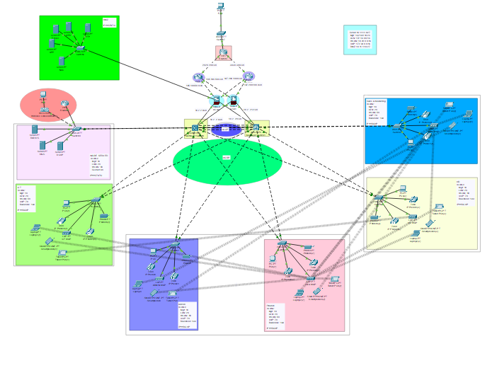

> The image below shows proper routing over port 70 (the VoIP port in this network), allowing phone calls inside the network through the routed phones.

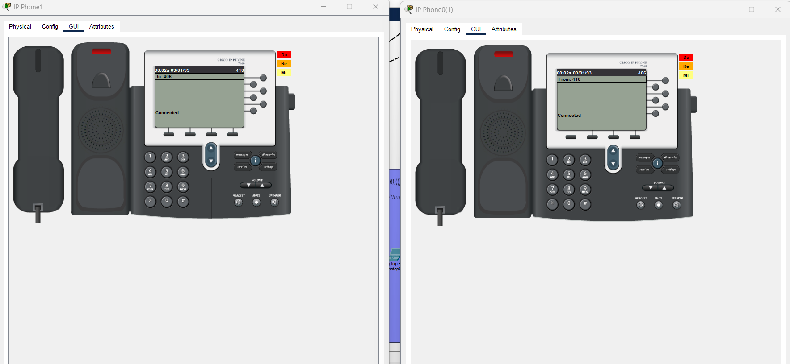

> The images below show proper subnetting and configuration for the firewalls and switches. Additional configurations can be made, like ZTA (Zero-Trust architecture), but with this network's parameters, it isn't nessicary. 

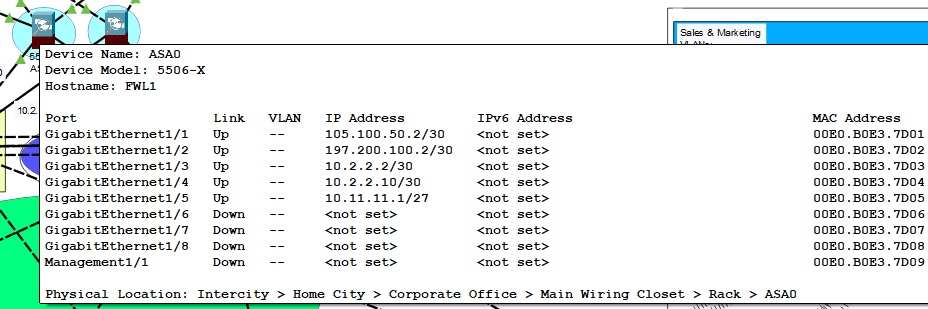

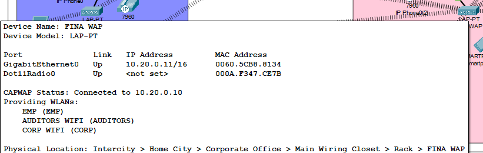

# Project 3: Crypto Web Scraping

  This web scraping code pulls live HTML code from a website, cleans the data, titles, and dates, and appends the price of cryptocurrencies in a CSV file.

> The first lines in the code are imports. There are imports for pulling HTML scripts, CSV file creation, and additional imports for expansion into new currencies.

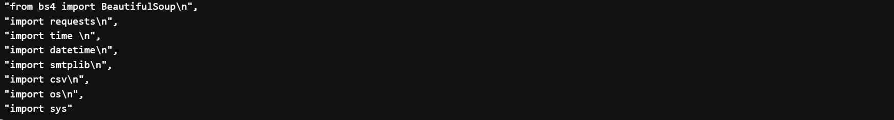

> Next is the base code, def bitcoin_code(); it pulls the URL's HTML script, looks for the updated price of the coin, and displays it. The xxx-xxx-xxx-xxx represents the user agents. 

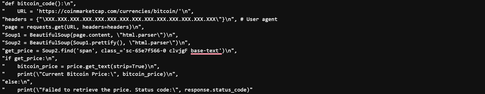

> Lastly, the code creates a CSV file and appendes the price in the file every day. The code can be further optimized, but with the simplicity of this project, it seemed redundant to do so.

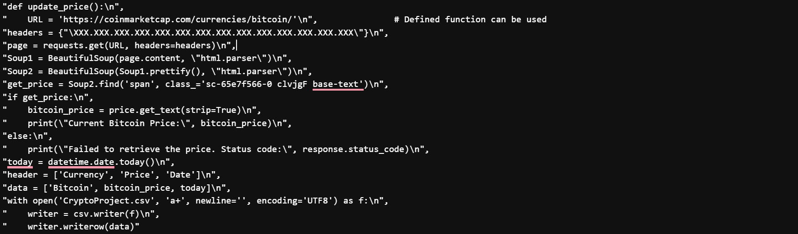

# Project 4: Phishing Campaign

This is a phishing campaign set up and is the simplest of these projects. It uses an open-source program called Go-Phishin to operate and manage a phishing campaign with ease.

> The code below is the HTML code that will generate the directed page to get the target's Gmail credentials. While not 100% accurate to the modern sign-in screen, this will be able to do the trick for most people who will fall for e-mail-based phishing attacks. 

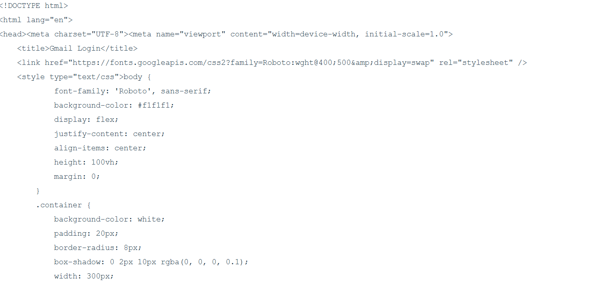

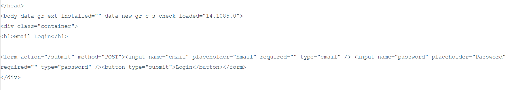

> This is the generated page.

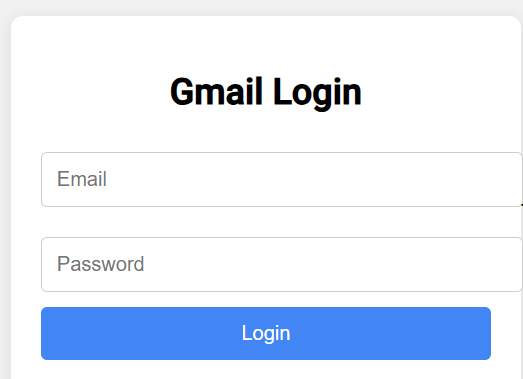

> The image below is the main dashboard to show the active users you're trying to target. I only have one due to legal restraints regarding phishing.

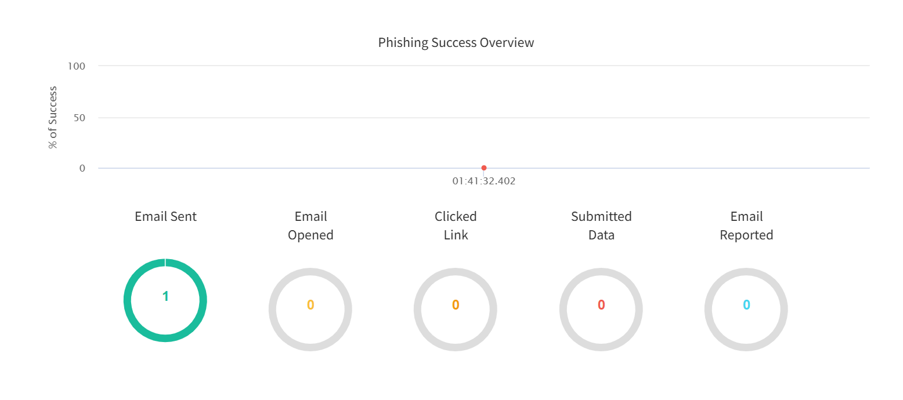


### Header 3

```js
// Javascript code with syntax highlighting.
var fun = function lang(l) {
  dateformat.i18n = require('./lang/' + l)
  return true;
}
```

```ruby
# Ruby code with syntax highlighting
GitHubPages::Dependencies.gems.each do |gem, version|
  s.add_dependency(gem, "= #{version}")
end
```

#### Header 4

*   This is an unordered list following a header.
*   This is an unordered list following a header.
*   This is an unordered list following a header.

##### Header 5

1.  This is an ordered list following a header.
2.  This is an ordered list following a header.
3.  This is an ordered list following a header.

###### Header 6

| head1        | head two          | three |
|:-------------|:------------------|:------|
| ok           | good swedish fish | nice  |
| out of stock | good and plenty   | nice  |
| ok           | good `oreos`      | hmm   |
| ok           | good `zoute` drop | yumm  |

### There's a horizontal rule below this.

* * *

### Here is an unordered list:

*   Item foo
*   Item bar
*   Item baz
*   Item zip

### And an ordered list:

1.  Item one
1.  Item two
1.  Item three
1.  Item four

### And a nested list:

- level 1 item
  - level 2 item
  - level 2 item
    - level 3 item
    - level 3 item
- level 1 item
  - level 2 item
  - level 2 item
  - level 2 item
- level 1 item
  - level 2 item
  - level 2 item
- level 1 item

### Small image


### Large image


### Definition lists can be used with HTML syntax.

<dl>
<dt>Name</dt>
<dd>Godzilla</dd>
<dt>Born</dt>
<dd>1952</dd>
<dt>Birthplace</dt>
<dd>Japan</dd>
<dt>Color</dt>
<dd>Green</dd>
</dl>

```
Long, single-line code blocks should not wrap. They should horizontally scroll if they are too long. This line should be long enough to demonstrate this.
```

```
The final element.
```
